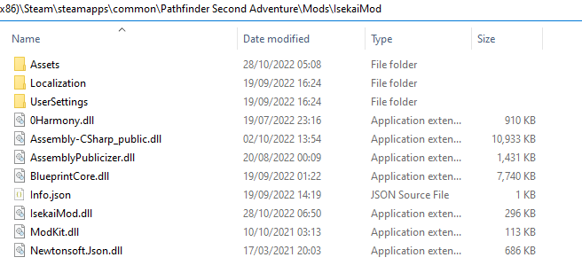

# Isekai Mod
This is a content mod for `Pathfinder: Wrath of the Righteous` that adds an `Isekai Protagonist` Class into the game.
## Development Guide
### Requirements
- Visual Studio 2019 (You can use the latest version if you know what you're doing)
### Setup
- Add `WrathPath` as an environment variable with the value `C:\Program Files (x86)\Steam\steamapps\common\Pathfinder Second Adventure` or wherever your game directory is.
- Open Visual Studio and [publicize your assemblies](https://github.com/WittleWolfie/OwlcatModdingWiki/wiki/Publicize-Assemblies) (`SolutionDir` can be replaced with `WrathPath`).
### Testing
- Create a folder called `IsekaiMod` in `C:\Program Files (x86)\Steam\steamapps\common\Pathfinder Second Adventure\Mods`.
- After building your solution in Visual Studio, go to your project directory -> `bin` -> `Release` or `Debug` -> `IsekaiMod` -> `net472`.
- Copy the files and folders from the image below and place them in the folder you created (ignore `UserSettings`).

- Create the `UserSettings` folder here and copy the `AddedContent.json` and the `Blueprints.json` files from the project and place them in this `UserSettings` folder.
- Now you can start your game and test.

On subsequent tests you'll only need to copy the `IsekaiMod.dll`.
- If you edited the blueprint names, copy `Blueprints.json` as well.
- If you added new assets, copy those as well.
## Mod Information
### Requirements
- [Unity Mod Manager](https://www.nexusmods.com/site/mods/21).
### Installation
- Open Unity Mod Manager and go to the 'Mods' tab.
- Drag and Drop the IsekaiMod.zip file into Unity Mod Manager.
### New Content
- New Classes & Archetypes
	- `Isekai Protagonist`
		- Spontaneous caster that uses Charisma.
		- Has a really powerful spellbook that has all the wizard, cleric, and druid spells.
		- Has sneak attack.
		- Has extra feats like the fighter but not limited to combat feats.
		- Starts of with the `Plot Armor` feature which make them hard to kill.
		- Has Overpowered Abilities.
		- Can merge their spellbook with angel or lich.
		- Can choose a familiar or animal companion... or a deathsnatcher.
	- `God Emperor` (Isekai Protagonist Archetype)
		- Has powerful auras that buff allies and debuff enemies.
		- Has powerful immunities in the late game.
	- `Edge Lord` (Isekai Protagonist Archetype)
		- Has alot of extra attacks.
		- Uses dexterity for damage and attack rolls.
	- `Hero` (Isekai Protagonist Archetype)
		- Has the `True Smite` ability (smite any alignment).
		- Uses charisma for damage and attack rolls.
	- `Villain` (Isekai Protagonist Archetype)
		- Has studied target.
		- Intelligence based caster that memorizes spells (becomes like wizard).
- New Features
	- `Exceptional feats`: Strong feats that can be chosen in place of a feat/bonus feat.
		- `Mythic feat`: You can choose a mythic feat instead of a normal/bonus feat.
		- `Effect Immunity`: You become immune to a specific effect. (e.g. poison, bleed, charm etc.)
		- `Exceptional Summoning`: Your summons get +100 HP, +10 attack, AC, and saving throws.
	- `Plot Armor`: Get bonus on AC and Saving throws based on character level.
	- `Character Development Feats`: A selection of bonus feats which have very good effects.
		- `Alpha Strike`: Automatically confirm crits.
		- `Beta Strike`: Get an extra attack with a -4 damage penalty.
		- `Gamma Strike`: Ignore concealment and your attacks count as adamantine.
		- `Mundane Aura`: Get immunity to sneak attack and critical hits.
		- `Regeneration`: Get regeneration 20/acid or fire (requires character level 10).
		- `Training Montage`: Get a +10 bonus to all attributes (requires character level 10).
		- `Body Strengthening`: Get a DR/— bonus equal to 10 + character level.
		- `Spell Negation`: Get Spell resistance equal to 10 + twice character level.
		- `Extreme Speed`: Get a speed bonus equal to 5 times character level.
		- `Channel Positive Energy`: You can channel positive energy (requires good alignment).
		- `Channel Negative Energy`: You can channel negative energy (requires evil alignment).
	- `Overpowered Ability`: Powerful gamebreaking abilities.
		- `AutoBolster`: Bolsters every spell you cast.
		- `AutoEmpower`: Empowers every spell you cast.
		- `AutoExtend`: Extends every spell you cast.
		- `AutoMaximize`: Maximizes every spell you cast.
		- `AutoQuicken`: Quickens every spell you cast.
		- `AutoReach`: Gives more range on every spell you cast.
		- `Grasp Heart`: Kills target creature (no HP limit).
		- `Dupe Gold`: Get infinite gold.
		- `Perfect Roll`: Roll 20 on every d20 roll.
		- `Super Buff`: Apply many powerful buffs on you and your allies.
		- `Interdimensional Bag`: Get infinite carry capacity.
		- `Unlimited Power`: Restore all ability and spell slots at will.
		- `Mind Control`: Control an enemy creature to fight for you.
- New Animal Companion
	- `Deathsnatcher`: A chaotic evil monstrous humanoid companion that can cast the animate dead spell. (Warning: very unbalanced)
- New Mythic abilities
	- `Mythic Overpowered Ability`: Gives you another Overpowered Ability.
- New Backgrounds
	- `Tabletop RPG Player`: Adds all Lore and Knowledge skills as class skills. Lore and Knowledge skills use CHA instead of WIS/INT.
	- `Martial Artist`: Get proficiency in all exotic weapons.
	- `Salaryman`: Adds perception as a class skill. Perception uses CHA instead of WIS.
	- `Highschool Student`: Get a +1 trait bonus to all attributes.
	- `Reborn Demon Lord`: Get a +2 trait bonus to Strength and Electricity resistance 20.
	- `Otaku`: Adds all skills as class skills except Persuasion.
	- `Gamer`: Get a +4 competence bonus to all knowledge, lore, and perception checks.
	- `Beta Tester`: Get +10 Initiative and adds lore, knowledge and perceptions skills as class skills.
- New Heritages
	- `Isekai Angel` (Aasimar Heritage): A powerful heritage for Aasimar that gives you wings and a powerful holy damage ability.
	- `Isekai Succubus` (Tiefling Heritage): A powerful heritage for Tiefling that gives you wings and a powerful charm ability.
	- `Isekai Vampire` (Dhampir Heritage): A powerful heritage for Dhampir.
	- `Isekai Drow` (Elf Heritage): A powerful heritage for Elf that gives you the Drow Poison ability.
	- `Isekai Spriggan` (Gnome Heritage): A powerful heritage for Gnome that gives you a size alteration ability.
- New Deities
	- `Truck-kun`: A god of transportation.
	- `Aqua`: A goddess of water.
	- `Ristarte`: A goddess of healing.
	- `Administrator D`: An ultimate god of evil.
- New Dialogue
	- Prologue, speaking with Hulrun at Kenabres Festival.
	- Act 1, Shield Maze after finding Radiance.

### Isekai Protagonist Spell progression
#### Spells per Day table
| Level | 1st | 2nd | 3rd | 4th | 5th | 6th | 7th | 8th | 9th |
|-------|-----|-----|-----|-----|-----|-----|-----|-----|-----|
| 1     | 3   |     |     |     |     |     |     |     |     |
| 2     | 6   |     |     |     |     |     |     |     |     |
| 3     | 9   | 3   |     |     |     |     |     |     |     |
| 4     | 12  | 6   |     |     |     |     |     |     |     |
| 5     | 12  | 9   | 3   |     |     |     |     |     |     |
| 6     | 12  | 12  | 6   |     |     |     |     |     |     |
| 7     | 12  | 12  | 9   | 3   |     |     |     |     |     |
| 8     | 12  | 12  | 12  | 6   |     |     |     |     |     |
| 9     | 12  | 12  | 12  | 9   | 3   |     |     |     |     |
| 10    | 12  | 12  | 12  | 12  | 6   |     |     |     |     |
| 11    | 12  | 12  | 12  | 12  | 9   | 3   |     |     |     |
| 12    | 12  | 12  | 12  | 12  | 12  | 6   |     |     |     |
| 13    | 12  | 12  | 12  | 12  | 12  | 9   | 3   |     |     |
| 14    | 12  | 12  | 12  | 12  | 12  | 12  | 6   |     |     |
| 15    | 12  | 12  | 12  | 12  | 12  | 12  | 9   | 3   |     |
| 16    | 12  | 12  | 12  | 12  | 12  | 12  | 12  | 6   |     |
| 17    | 12  | 12  | 12  | 12  | 12  | 12  | 12  | 9   | 3   |
| 18    | 12  | 12  | 12  | 12  | 12  | 12  | 12  | 12  | 6   |
| 19    | 12  | 12  | 12  | 12  | 12  | 12  | 12  | 12  | 9   |
| 20    | 12  | 12  | 12  | 12  | 12  | 12  | 12  | 12  | 12  |
#### Spells Known table
| Level | 1st | 2nd | 3rd | 4th | 5th | 6th | 7th | 8th | 9th |
|-------|-----|-----|-----|-----|-----|-----|-----|-----|-----|
| 1     | 6   |     |     |     |     |     |     |     |     |
| 2     | 12  |     |     |     |     |     |     |     |     |
| 3     | 18  | 6   |     |     |     |     |     |     |     |
| 4     | 24  | 12  |     |     |     |     |     |     |     |
| 5     | 24  | 18  | 6   |     |     |     |     |     |     |
| 6     | 30  | 24  | 6   |     |     |     |     |     |     |
| 7     | 30  | 24  | 12  | 6   |     |     |     |     |     |
| 8     | 30  | 30  | 18  | 6   |     |     |     |     |     |
| 9     | 30  | 30  | 18  | 12  | 6   |     |     |     |     |
| 10    | 30  | 30  | 24  | 18  | 6   |     |     |     |     |
| 11    | 30  | 30  | 24  | 18  | 12  | 6   |     |     |     |
| 12    | 30  | 30  | 24  | 24  | 18  | 6   |     |     |     |
| 13    | 30  | 30  | 24  | 24  | 18  | 12  | 6   |     |     |
| 14    | 30  | 30  | 24  | 24  | 24  | 18  | 6   |     |     |
| 15    | 30  | 30  | 24  | 24  | 24  | 18  | 12  | 6   |     |
| 16    | 30  | 30  | 24  | 24  | 24  | 24  | 18  | 6   |     |
| 17    | 30  | 30  | 24  | 24  | 24  | 24  | 18  | 12  | 6   |
| 18    | 30  | 30  | 24  | 24  | 24  | 24  | 24  | 18  | 6   |
| 19    | 30  | 30  | 24  | 24  | 24  | 24  | 24  | 24  | 12  |
| 20    | 30  | 30  | 24  | 24  | 24  | 24  | 24  | 24  | 20  |

## Mod Support
This mod has support for the following mods.
### MysticalMayhem (0.1.3)
If you have the `MysticalMayhem` mod, the `Isekai Protagonist` will have the 9th level `Meteor Swarm` spell added to its spellbook.
### ExpandedContent (0.4.40)
If you have the `ExpandedContent` mod, the `Isekai Protagonist` will have the following spells added to its spellbook: Hydraulic push, Slipstream, Scourge of the Horsemen, Rigor mortis, Hollow Blades, Goodberry, Steam Ray Fusillade, Inflict Pain, Inflict Pain Mass, Gloomblind Bolts, Fury of the Sun, Invoke Deity.
You are also able to choose a drake companion as a pet.
### SpellbookMerge (1.7.0)
If you have the `SpellbookMerge` mod, the `Isekai Protagonist` will be able to merge its spellbook with Aeon, Azata, Demon, and Trickster.

## Credits
Alot of the code was repurposed from the following repositories:
- https://github.com/Vek17/TabletopTweaks-Base
- https://github.com/ka-dyn/ExpandedContent

Thanks to Vek17, ka-dyn, bittercranberry, WittleWolfie and all other other contributors for their code.
Special thanks to WittleWolfie for creating this modding guide that helped me get started:
- https://github.com/WittleWolfie/OwlcatModdingWiki/wiki
